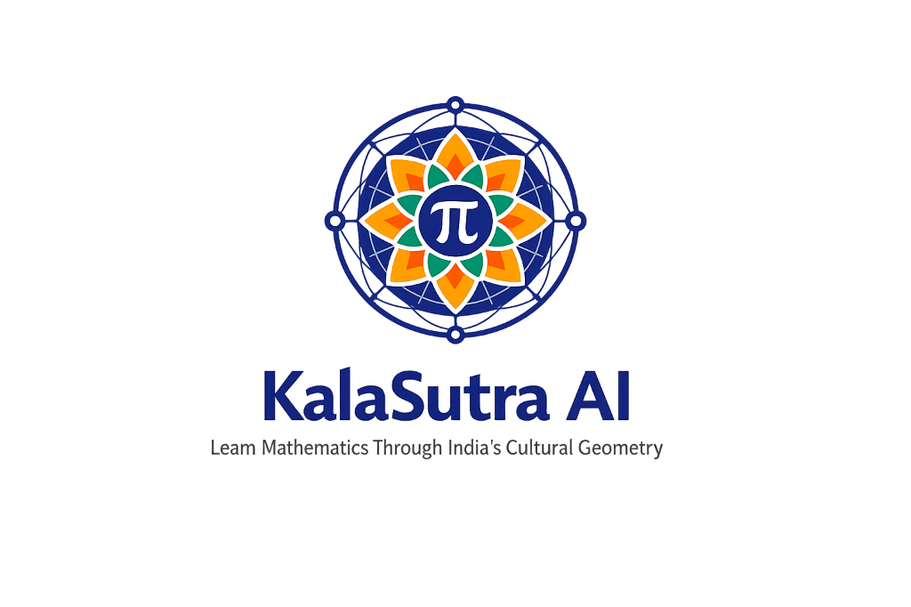
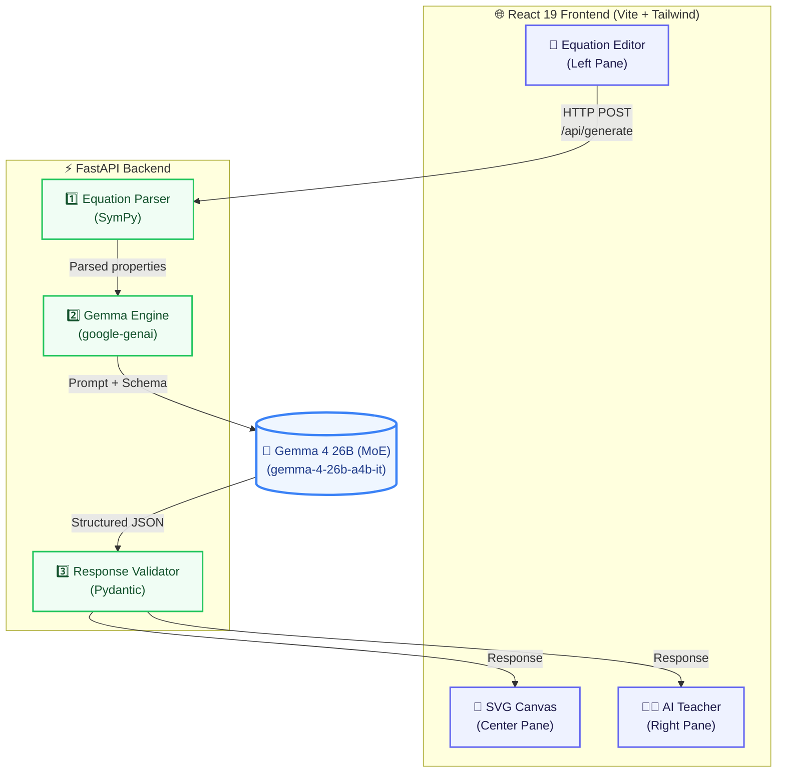
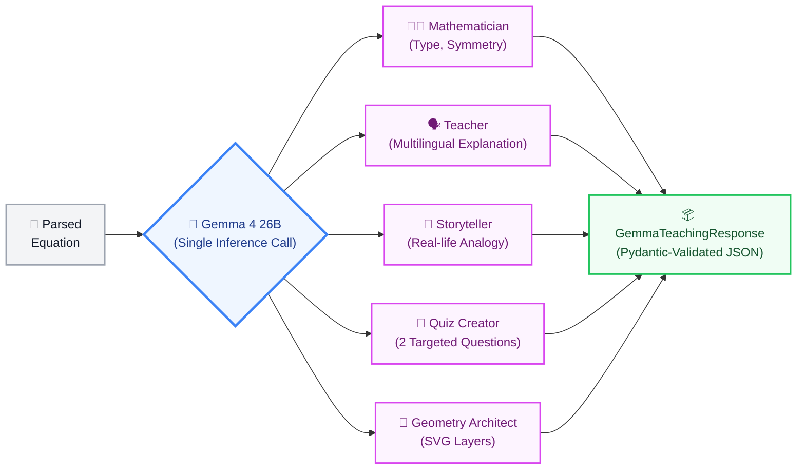

<div align="center">



# KalaSutra AI

### *Kala (कला) = Art &nbsp;·&nbsp; Sutra (सूत्र) = Formula*

**An AI-powered educational platform that transforms mathematical equations into animated Indian cultural geometry — with a built-in multilingual AI Teacher powered by Gemma.**

<br />

[](https://python.org)
[](https://fastapi.tiangolo.com)
[](https://react.dev)
[](https://typescriptlang.org)
[](https://ai.google.dev/gemma)
[](LICENSE)

<br />

[📓 Kaggle Writeup](https://www.kaggle.com/competitions/gemma-for-bharat-gd-go-c-jis-university-2026/writeups/kalasutra-ai) &nbsp;·&nbsp; [🎬 Demo Video](https://youtu.be/MrhGDKtzK6g?si=j6GcDj0ORcL3CaGs)

</div>

<br />

> **"280 million Indian students study in regional languages — yet almost every math visualisation tool speaks only English and uses only Western metaphors. KalaSutra AI changes that."**

---

<details>
<summary><b>📌 Table of Contents</b> (click to expand)</summary>

- [The Problem We Solve](#-the-problem-we-solve)
- [Our Solution](#-our-solution)
- [Key Features](#-key-features)
- [Quick Start — Try It Now](#-quick-start--try-it-now)
- [System Architecture](#-system-architecture)
- [How Gemma Powers KalaSutra](#-how-gemma-powers-kalasutra)
- [Why We Chose Gemma 4 26B MoE](#-why-we-chose-gemma-4-26b-moe)
- [Tech Stack](#-tech-stack)
- [Project Structure](#-project-structure)
- [Local Development Setup](#-local-development-setup)
- [API Reference](#-api-reference)
- [Supported Languages](#-supported-languages)
- [Contributing](#-contributing)
- [License](#-license)

</details>

---

## 🎯 The Problem We Solve

Mathematics is the single most failed subject across Indian board exams. Three systemic gaps make it worse:

| Gap | Impact |
|---|---|
| **🔇 Abstraction** | Static textbooks cannot show how changing `sin(4θ)` → `sin(8θ)` transforms the geometry. Students memorise formulas without understanding shapes. |
| **🌐 Language Barrier** | 280M+ students study in Hindi, Bengali, Tamil, or Telugu — yet quality visual math resources exist almost exclusively in English. |
| **🎭 Cultural Disconnect** | Global EdTech defaults to Western visual metaphors. Indian students don't see their own cultural geometry (Rangoli, Kolam, Mandala) reflected in math education. |

### Who Is This For?

| Segment | Users |
|---|---|
| **Primary** | Class 9–12 students · JEE / NEET aspirants · Engineering undergraduates |
| **Secondary** | Mathematics teachers · Coaching institutes · Parents |

---

## 💡 Our Solution

KalaSutra AI is a **full-stack educational tool** that turns any mathematical equation into an interactive learning experience rooted in Indian culture.

A student types an equation. The system responds with:

```
Equation  →  Animated Cultural Artwork  +  AI Teacher Explanation  +  Quiz  +  Real-Life Connection
                (Rangoli / Mandala /         (in their own             (2 auto-generated    (contextualised
                 Kolam / Alpana)              language)                 questions)           analogy)
```

> **This is not a chatbot. This is not "Chat with PDF". This is a purpose-built learning loop — equation → visualisation → explanation → assessment — in one seamless interface.**

---

## ⭐ Key Features

| | Feature | What It Does |
|---|---|---|
| 🧮 | **Equation Interpreter** | SymPy-powered parser handles polar, parametric, and algebraic equations. Extracts variables, functions, and symmetry order automatically. |
| 🎨 | **Cultural Geometry Generator** | Renders equations as **Rangoli**, **Mandala**, **Kolam**, or **Alpana** artwork — culturally familiar Indian geometric art forms. |
| 🎬 | **Animated SVG Canvas** | Framer Motion draws each geometric layer sequentially — circles, petals, dots, spirals, polygons — creating a compelling visual reveal. |
| 🧠 | **AI Teacher Panel** | Gemma explains *why* the shape looks the way it does, in the student's own language. Concise (≤40 words), pedagogically targeted. |
| 🌍 | **5 Indian Languages** | English · Hindi (हिंदी) · Bengali (বাংলা) · Tamil (தமிழ்) · Telugu (తెలుగు) |
| 📝 | **AI Quiz Generator** | 2 auto-generated questions per equation (MCQ + short answer) to reinforce understanding immediately. |
| 🔗 | **Real-Life Connections** | Contextualises every concept — satellite dishes, clock gears, manhole covers — so math feels tangible. |
| 🔄 | **Parameter Playground** | Change any coefficient and instantly see how symmetry, petal count, and geometry evolve. |
| 📥 | **SVG Export** | Download the generated artwork as a production-quality scalable vector file. |

---

## 🧪 Quick Start — Try It Now

Once the app is running, paste any of these equations into the **KalaSutra Canvas**:

| Equation | What You'll See | Recommended Theme |
|---|---|---|
| `r = sin(8*theta)` | 🌸 8-petal Polar Rose with 8-fold symmetry | Rangoli |
| `r = cos(12*theta)` | 🌺 12-petal Rose — intricate circular pattern | Mandala |
| `r = theta` | 🌀 Archimedean Spiral — expanding outward | Kolam |
| `r = 1 + sin(theta)` | 💗 Cardioid — heart-shaped curve | Alpana |
| `r = sin(theta) * cos(theta)` | 🌼 4-petal flower | Rangoli |

> **💡 Pro-tip:** Change the coefficient of `theta` (e.g., `8` → `6` in `sin(8*theta)`) to watch the symmetry transform in real time!

---

## 🏗 System Architecture



### Request Flow

| Step | Phase | What Happens |
|---|---|---|
| **1** | **Input** | User enters an equation (e.g., `r = sin(8θ)`), selects a cultural theme and language. |
| **2** | **Parse** | The backend's SymPy-based parser extracts equation type, free variables, trig functions, and symmetry order. |
| **3** | **Reason** | Parsed data is sent to **Gemma 4 26B (MoE)** with a strict Pydantic schema enforcing structured JSON output. |
| **4** | **Respond** | Gemma returns a `GemmaTeachingResponse` — concept, explanation, quiz, real-life connection, and rendering instructions. |
| **5** | **Render** | React frontend populates the AI Teacher panel and animates the SVG canvas layer by layer using Framer Motion. |

---

## 🧠 How Gemma Powers KalaSutra

**Gemma is not a wrapper.** It is the reasoning core of the entire application, performing **5 distinct roles in a single structured inference call:**



We enforce **deterministic structured output** using `response_mime_type="application/json"` with a strict `response_schema=GemmaTeachingResponse` Pydantic model. This means every response is machine-parseable and UI-ready — no regex extraction, no post-processing hacks.

> **Key insight:** This architecture cleanly separates **reasoning** (Gemma) from **rendering** (React/SVG), keeping the system modular, testable, and language-agnostic.

---

## 🎯 Why We Chose Gemma 4 26B MoE

We evaluated every available Gemma variant. Here's why `gemma-4-26b-a4b-it` won:

| Factor | Why This Variant Fits |
|---|---|
| **Structured JSON Output** | Supports `response_schema` via the Google GenAI SDK — critical for our multi-role output (explanation + quiz + rendering) in a single deterministic call. |
| **Multilingual Strength** | Strong performance across Hindi, Bengali, Tamil, and Telugu — serving our target audience of **280M+ regional-language students**. |
| **MoE Efficiency** | Activates only **4B of 26B parameters per token** — fast inference ideal for an interactive tool where students expect real-time feedback. |
| **Math Reasoning** | Sufficient depth to analyse polar/parametric equations, extract symmetry properties, and generate pedagogically accurate explanations. |
| **Instruction-Tuned** | The `-it` variant reliably follows complex multi-constraint prompts (e.g., "explain in ≤40 words in Tamil while also producing geometry layer instructions"). |

<details>
<summary><b>Why Not Other Variants?</b> (click to expand)</summary>

| Variant | Reason for Rejection |
|---|---|
| **Gemma 2B / 4B** | Insufficient reasoning depth for math concept extraction + quiz generation + geometry instructions in a single structured call. |
| **Gemma 27B Dense** | Higher latency per token vs. the 26B MoE variant, with no significant quality gain for our structured-output use case. |
| **Gemma 31B Dense** | Overkill — the MoE variant offers a better latency/quality tradeoff for interactive educational applications. |

</details>

---

## 🛠 Tech Stack

### Backend

| Technology | Version | Role |
|---|---|---|
| **Python** | 3.9+ | Core language |
| **FastAPI** | Latest | REST API framework with auto-generated OpenAPI docs |
| **Pydantic** | v2 | Request / response validation & structured output schema for Gemma |
| **google-genai** | Latest | Official Google GenAI Python SDK |
| **Gemma 4 26B (MoE)** | `gemma-4-26b-a4b-it` | Primary LLM inference engine |
| **SymPy** | 1.13+ | Symbolic math parsing & equation analysis |
| **Uvicorn** | Latest | ASGI server |

### Frontend

| Technology | Version | Role |
|---|---|---|
| **React** | 19 | UI framework |
| **TypeScript** | 6.0 | Type safety across all components |
| **Vite** | 8 | Build tooling & dev server |
| **TailwindCSS** | 3.4 | Utility-first styling |
| **Framer Motion** | 12 | SVG path draw animations |
| **Axios** | 1.18 | HTTP client |
| **Lucide React** | 1.24 | Icon library |

---

## 📁 Project Structure

```
KalaSutra AI/
├── README.md                      # This file
├── LICENSE                        # MIT License
├── CODE_OF_CONDUCT.md             # Contributor Covenant v2.1
├── CONTRIBUTING.md                # Contribution guidelines
├── SECURITY.md                    # Security policy
├── logo.png                       # Project logo
│
├── backend/
│   ├── README.md                  # Backend-specific documentation
│   ├── requirements.txt           # Python dependencies
│   ├── .env                       # API key (not committed)
│   └── app/
│       ├── main.py                # FastAPI entry point + CORS
│       ├── api/
│       │   └── generate.py        # POST /api/generate endpoint
│       ├── gemma/
│       │   └── engine.py          # Gemma inference + prompt engineering
│       ├── parser/
│       │   └── equation.py        # SymPy equation parser
│       └── schemas/
│           └── models.py          # Pydantic models (request / response)
│
└── frontend/
    ├── README.md                  # Frontend-specific documentation
    ├── index.html                 # HTML entry point + SEO meta tags
    ├── package.json               # Node.js dependencies
    └── src/
        ├── App.tsx                # Root component — layout, state, API calls
        ├── main.tsx               # Vite entry point
        ├── index.css              # Tailwind base + Inter font
        ├── types/
        │   └── index.ts           # Shared TypeScript type definitions
        └── components/
            ├── EquationEditor.tsx  # Left pane — equation input form
            ├── Preview.tsx         # Center pane — animated SVG canvas
            └── AITeacherPanel.tsx  # Right pane — AI Teacher, quiz, symmetry
```

---

## 💻 Local Development Setup

### Prerequisites

| Requirement | Version |
|---|---|
| Python | 3.9+ |
| Node.js | 18+ |
| Gemma API Key | [Get one free →](https://aistudio.google.com/app/apikey) |

### 1. Clone the Repository

```bash
git clone https://github.com/dasouvik122005/KalaSutra-AI.git
cd KalaSutra-AI
```

### 2. Backend

```bash
cd backend

# Create and activate virtual environment
python -m venv venv
venv\Scripts\activate        # Windows
# source venv/bin/activate   # macOS / Linux

# Install dependencies
pip install -r requirements.txt

# Configure API key
echo GEMINI_API_KEY=your_key_here > .env

# Start the server
uvicorn app.main:app --reload
```

> ⚠️ **Never commit your `.env` file.** It is already in `.gitignore`.

| Service | URL |
|---|---|
| REST API | `http://localhost:8000` |
| Swagger UI | `http://localhost:8000/docs` |

### 3. Frontend

```bash
# Open a new terminal
cd frontend
npm install
npm run dev
```

The application will be available at **`http://localhost:5173`**

---

## 📡 API Reference

### `POST /api/generate`

Generates teaching materials and rendering instructions for a given equation.

**Request**

```json
{
  "equation": "r = sin(8*theta)",
  "theme": "rangoli",
  "complexity": "medium",
  "language": "English"
}
```

| Field | Type | Required | Options | Default |
|---|---|---|---|---|
| `equation` | `string` | ✅ | Any math expression | — |
| `theme` | `string` | ✅ | `rangoli` · `mandala` · `kolam` · `alpana` | — |
| `complexity` | `string` | ❌ | `low` · `medium` · `high` | `medium` |
| `language` | `string` | ❌ | `English` · `Hindi` · `Bengali` · `Tamil` · `Telugu` | `English` |

<details>
<summary><b>Response Body (200 OK)</b> — click to expand</summary>

```json
{
  "data": {
    "concept": "Polar Rose Curve",
    "symmetry": "8-fold",
    "difficulty": "Medium",
    "explanation": "The number 8 in sin(8θ) creates 8 petals evenly distributed around the origin.",
    "real_life_connection": "Used in antenna design to produce directional signal patterns.",
    "quiz": [
      {
        "question": "What determines the number of petals in r = sin(nθ)?",
        "type": "mcq",
        "options": ["The coefficient n of θ", "The amplitude", "The frequency", "The phase"],
        "answer": "The coefficient n of θ"
      },
      {
        "question": "What symmetry does r = sin(8θ) exhibit?",
        "type": "short_answer",
        "options": null,
        "answer": "8-fold rotational symmetry"
      }
    ],
    "rendering": {
      "canvas": { "width": 1000, "height": 1000, "background": "none" },
      "layers": [
        { "type": "circle", "radius": 220, "stroke": "#e0e7ff", "fill": "none", "stroke_width": 1 },
        { "type": "petal", "count": 8, "radius": 200, "stroke": "#6366f1", "fill": "#e0e7ff", "stroke_width": 1.5 },
        { "type": "dots", "count": 8, "radius": 200, "dot_radius": 5, "stroke": "#4f46e5", "fill": "#4f46e5" }
      ],
      "pattern": "8-Petal Rose Rangoli"
    }
  }
}
```

</details>

### `GET /health`

```json
{ "status": "ok" }
```

---

## 🌏 Supported Languages

| Language | Native Script | Code |
|---|---|---|
| English | English | `English` |
| Hindi | हिंदी | `Hindi` |
| Bengali | বাংলা | `Bengali` |
| Tamil | தமிழ் | `Tamil` |
| Telugu | తెలుగు | `Telugu` |

---

## 🤝 Contributing

Contributions are welcome! Please read our [Contributing Guide](CONTRIBUTING.md) and [Code of Conduct](CODE_OF_CONDUCT.md) before getting started.

1. **Fork** the repository
2. **Create** a feature branch: `git checkout -b feature/your-feature`
3. **Commit** your changes: `git commit -m 'feat: add your feature'`
4. **Push** to your branch: `git push origin feature/your-feature`
5. **Open** a Pull Request

---

## 📄 License

This project is licensed under the **MIT License** — see the [LICENSE](LICENSE) file for details.

---

<div align="center">

<br />

**Built with ❤️ for the [Google — Build with Gemma](https://www.kaggle.com/competitions/build-with-gemma) Kaggle Competition**

*Powered by Gemma 4 26B (MoE) — Bridging Mathematics and Culture, one equation at a time.*

<br />

[](https://ai.google.dev/gemma)

</div>
